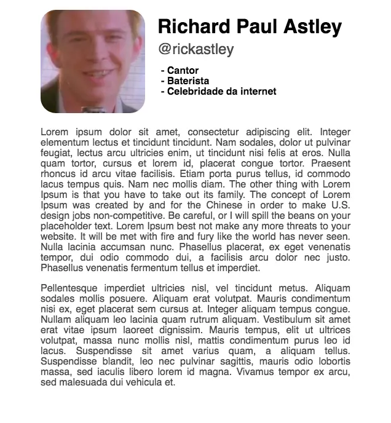
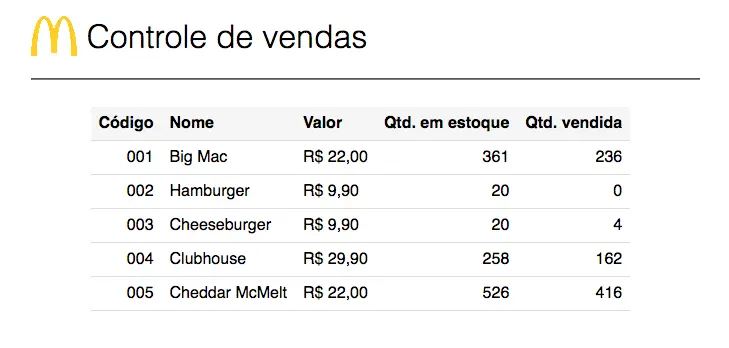
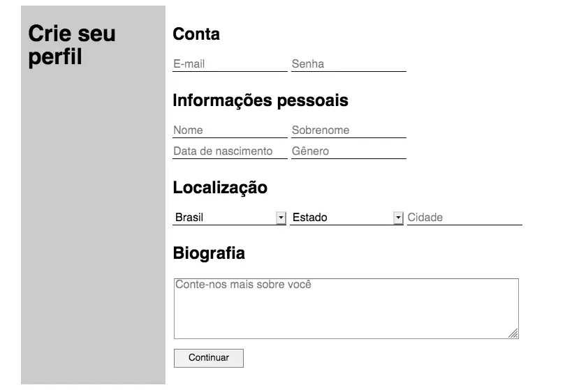
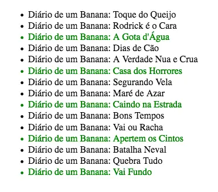
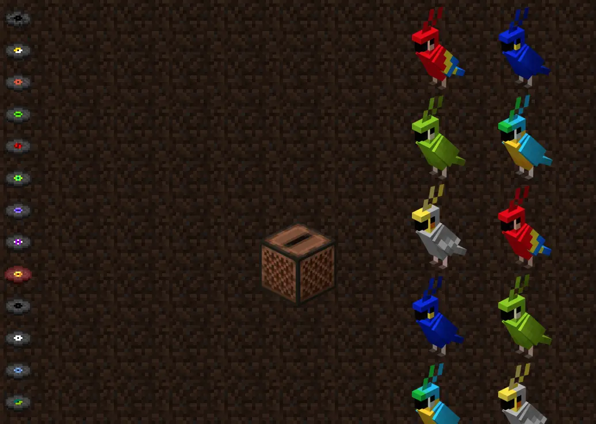
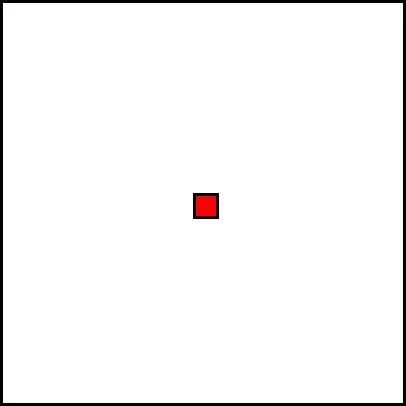

<h1 id="desenvolvimento-web-com-javascript">Desenvolvimento web com Javascript</h1>

Esta disciplina foi ministrada por <strong><a href="https://github.com/wilsonjr">Wilson Júnior</a></strong> e faz parte da grade opcional do curso de Bacharelado em Ciência da Computação na Unesp.

<h3 id="conte-do-">Conteúdo:</h3>

<b>Aula 1</b> – Introdução ao HTML

&nbsp;&nbsp;&nbsp;&nbsp;<strong>Exercícios propostos:</strong> 

<ul>
<li><a href="https://yudi.github.io/desenvolvimento-web/Aula%201/Exercício%201/index.html">Uma página pessoal</a>;</li>
<li><a href="https://yudi.github.io/desenvolvimento-web/Aula%201/Exercício%202/index.html">Uma tabela com o inventário de uma loja</a>.</li>
</ul>

&nbsp;&nbsp;&nbsp;&nbsp;Screenshots: 

<b>Aula 2*</b> – Introdução ao CSS

&nbsp;&nbsp;&nbsp;&nbsp;<strong>Exercício proposto:</strong> 

<ul>
<li><a href="https://yudi.github.io/desenvolvimento-web/Aula%202/Exercício%201/index.html">Aplicar os conhecimentos de CSS aprendidos na aula nos projetos da aula anterior</a>.</li>
</ul>

&nbsp;&nbsp;&nbsp;&nbsp;Entreguei os mesmos trabalho da aula anterior, sem alterações, pois eu há havia utilizado CSS nos arquivos. 

<b>Aula 3*</b> – Links, iframes e vídeos

&nbsp;&nbsp;&nbsp;&nbsp;Não houve exercício proposto pelo professor.

<b>Aula 4</b> – Contêineres

&nbsp;&nbsp;&nbsp;&nbsp;<strong>Exercícios propostos:</strong> 

<ul>
<li><a href="https://yudi.github.io/desenvolvimento-web/Aula%204/Exercício%201/index.html">Desafio – Criar uma página contendo apenas uma barra no topo da página, da largura do navegador. A barra deve conter um botão de menu à esquerda, título ao centro e um botão de saída à direta</a>;</li>
<li><a href="https://yudi.github.io/desenvolvimento-web/Aula%204/Exercício%202/index.html">Criar uma página completa de filmes contendo cabeçalho, menu, conteúdo e rodapé</a>.</li>
</ul>

&nbsp;&nbsp;&nbsp;&nbsp;Screenshots: 

<b>Aula 5</b> – Formulários

&nbsp;&nbsp;&nbsp;&nbsp;<strong>Exercícios propostos:</strong> 

<ul>
<li><a href="https://yudi.github.io/desenvolvimento-web/Aula%205/Exercício%201/index.html">Criar uma página para o cadastro em uma rede social</a>;</li>
<li>Qual a diferença entre os métodos GET e POST?</li>
</ul>

&nbsp;&nbsp;&nbsp;&nbsp;Screenshot: 

<b>Aula 6</b> – Posicionamento e fluxo do documento

&nbsp;&nbsp;&nbsp;&nbsp;<strong>Exercício proposto:</strong> 

<ul>
<li><a href="https://yudi.github.io/desenvolvimento-web/Aula%206/Exercício%201/index.html">Crie a página inicial de um blog sobre qualquer assunto. Devem ser exibidos <em>cards</em> referentes às postagens, contendo uma imagem, breve descrição e um título</a>.</li>
</ul>

&nbsp;&nbsp;&nbsp;&nbsp;Screenshot: 

<b>Aula 7</b> – Grid layout

&nbsp;&nbsp;&nbsp;&nbsp;<strong>Exercício proposto:</strong> 

<ul>
<li><a href="https://yudi.github.io/desenvolvimento-web/Aula%207/Exercício%201/index.html">Utilizar o <code>grid-template-areas</code> para organizar uma página com header, footer, main e navbar</a>.</li>
</ul>

&nbsp;&nbsp;&nbsp;&nbsp;Screenshot: 

<b>Aula 8</b> – Seletores avançados e recursos úteis

&nbsp;&nbsp;&nbsp;&nbsp;<strong>Exercícios propostos:</strong> 

<ul>
<li><a href="https://yudi.github.io/desenvolvimento-web/Aula%208/Exercício%201/index.html">Criar uma página que contenha uma lista cujos elementos têm cor diferente nas posições múltiplas de 3</a>;</li>
<li><a href="https://yudi.github.io/desenvolvimento-web/Aula%208/Exercício%202/index.html">Criar uma página que imite um artigo de jornal, em que a primeira letra de cada parágrafo apareça maior</a>;</li>
<li><a href="https://yudi.github.io/desenvolvimento-web/Aula%208/Exercício%203/index.html">Criar uma página que contenha um quadrado que, quando o cursor estiver posicionado em cima dele, o quadrado muda de posição e cor, com transições</a>.</li>
</ul>

&nbsp;&nbsp;&nbsp;&nbsp;Screenshots: 

<b>Aula 9</b> – Introdução ao Javascript

&nbsp;&nbsp;&nbsp;&nbsp;<strong>Exercícios propostos:</strong> 

<ul>
<li><a href="https://yudi.github.io/desenvolvimento-web/Aula%209/Exercício%201/index.html">Criar, em Javascript, uma sequência de questões afim de obter informações pessoais do usuário, para armazená-las em um objeto e, por fim, apresentá-las ao usuário em uma caixa de alerta</a>;</li>
<li><a href="https://yudi.github.io/desenvolvimento-web/Aula%209/Exercício%202/index.html">Criar um jogo de dados com dois jogadores. O objetivo do jogo é alcançar um valor limite com a soma dos dados de cada rodada. Cada jogador lança dois dados nas rodadas. Assim que um jogador atingir o valor limite (ou ultrapassá-lo), deve ser exibido &quot;fim de jogo&quot; e o vencedor</a>;</li>
</ul>

<b>Aula 10</b> – Manipulação do DOM

&nbsp;&nbsp;&nbsp;&nbsp;<strong>Exercícios propostos:</strong> 

<ul>
<li><a href="https://yudi.github.io/desenvolvimento-web/Aula%2010/Exercício%201/index.html">Criar, dinâmicamente (com Javascript), no lado esquerdo do site, uma lista com itens, também criados dinamicamente. Devem haver objetos criados dinamicamente na parte direita do site</a>;</li>
</ul>

&nbsp;&nbsp;&nbsp;&nbsp;Screenshot: 

<b>Aula 11</b> – Eventos em Javascript

&nbsp;&nbsp;&nbsp;&nbsp;<strong>Exercícios propostos:</strong> 

<ul>
<li>Criar um objeto controlado com as setas do teclado que, quando ele atingir as bordas de um quadro, ele volta à posição inicial:<ul>
<li><a href="https://yudi.github.io/desenvolvimento-web/Aula%2011/Exercício%201%201.0/index.html">Versão 1</a>;</li>
<li><a href="https://yudi.github.io/desenvolvimento-web/Aula%2011/Exercício%201%202.0/index.html">Versão 2</a>.</li>
</ul>
</li>
</ul>

&nbsp;&nbsp;&nbsp;&nbsp;Screenshots: 

<b>Aula 12*</b> – Web para dispositivos móveis e responsividade

&nbsp;&nbsp;&nbsp;&nbsp;Não houve exercício proposto pelo professor.

<b>Trabalho final</b>

<strong><a href="https://yudi.github.io/desenvolvimento-web/Trabalho%20final/index.html">Clique aqui para visualizar o trabalho final</a></strong>

Este trabalho foi desenvolvido em conjunto com <a href="https://github.com/cadusantana">Carlos Santana</a>.

Criar um site de compras que contém:

<ol>
<li>Página principal com apresentação de produtos;</li>
<li>Página com detalhes da compra e os dados do usuário;</li>
<li>Página com a confirmação do pedido.</li>
</ol>
<ol>
<li>
A página principal deve conter:

<ul>
<li>Todos os produtos disponíveis na loja<ul>
<li>Lidos de um objeto json</li>
</ul>
</li>
<li>Cada produto deve possuir:<ul>
<li>Nome;</li>
<li>Categoria;</li>
<li>Preço;</li>
<li>Imagem.</li>
</ul>
</li>
<li>Devem haver ao menos três categorias;</li>
<li>O usuário poderá filtrar produtos por categoria.</li>
<li>A página também deve conter:<ul>
<li>Uma barra de ferramentas para as filtragens (na lateral esquerda);</li>
<li>Uma barra na parte superior com o nome do site e um botão para finalizar a compra.</li>
</ul>
</li>
</ul>
</li>
<li>
A página com detalhes da compra e os dados do usuário deve conter:

<ul>
<li>Campos para os dados do usuário;</li>
<li>Um resumo da compra; Esta página corresponde ao carrinho de compras. Não é necessário apresentar informações sobre o método de pagamento.</li>
</ul>
</li>
<li>
A página com a confirmação do pedido deve conter:

<ul>
<li>Um resumo do pedido;</li>
<li>Tempo de frete gerado aleatoriamente.</li>
</ul>
</li>
</ol>

<strong><a href="https://yudi.github.io/desenvolvimento-web/Trabalho final/index.html">Clique aqui para visualizar o trabalho final</a></strong>  

&nbsp;&nbsp;&nbsp;&nbsp;Screenshot: 

*Não houve exercício proposto pelo professor.

